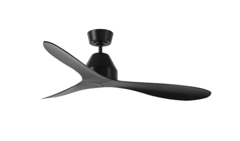

# Lucci Ceiling Fan (433 MHz) — ESP32 + CC1101 (OOK) Sniffer + Guided Learn + Pattern Export + TX

Sniff and replay **433 MHz OOK** commands from a Lucci ceiling fan remote using an **ESP32 + CC1101**.  
The workflow is:

1) **Sniffer (tools/sniffer)** learns which button is which (guided) and exports clean timing arrays (`P_*`).  
2) **TX (main firmware)** replays those patterns using **CC1101 direct OOK transmit**.

---


## What this repository contains

- **Sniffer firmware** (guided learn + export): `tools/sniffer/`
- **Main firmware** (TX + your app logic): repo root `src/`
- **TX module**:
  - `radio/radio_tx.h`
  - `radio/radio_tx.cpp`
- **Exported patterns header** (you generate this): `src/patterns/patterns.h` (recommended path)
<br>
<br>
<br>
> Legal / safety: use only on equipment you own or have explicit permission to test.

---

## License

This project is licensed under **GNU GPL v3 (or later)**.

- Add the full GPL text you posted earlier into: **`LICENSE`** (repo root)
- Recommended in source files: `SPDX-License-Identifier: GPL-3.0-or-later`

---

# Hardware

- ESP32 dev board
- CC1101 module for **433 MHz**
- Antenna tuned for 433 MHz
- Stable 3.3V power (**CC1101 is 3.3V only**)

---

## Wiring (ESP32 ↔ CC1101)

The code currently uses:

| CC1101 | ESP32 GPIO | Notes |
|---|---|---|
| GND  | GND | common ground |
| VCC  | 3V3 | **3.3V only**⚠️ |
| GDO0 | 4   | edge interrupt (RX) + data pin (TX direct) |
| CSN   | 5   | SPI chip select |
| SCK  | 18  | SPI clock |
| MOSI | 23  | SPI MOSI |
| MISO | 19  | SPI MISO |
| GDO2 | not connected  | unused |

Notes:
- CC1101 GDO2 are not used (`RADIOLIB_NC`).
- Good antenna matters more than most settings.

---

# Build & Flash (PlatformIO)

This repo has **two** PlatformIO projects:
- **Sniffer:** `tools/sniffer/`
- **Main firmware:** repo root

You can build from VS Code (PlatformIO) or CLI.

---

## Option A: Build in VS Code (recommended)

1) Install **VS Code** + **PlatformIO**
2) Open the repo folder in VS Code
3) In PlatformIO sidebar:
   - For sniffer: switch to `tools/sniffer` project (open that folder) and **Build/Upload/Monitor**
   - For main firmware: open repo root and **Build/Upload/Monitor**

---

## Option B: Build via CLI

### 1) Sniffer (tools/sniffer)

Build:
```bash
pio run -d tools/sniffer
```

Upload:
```bash
pio run -d tools/sniffer -t upload
```

Monitor:
```bash
pio device monitor -d tools/sniffer -b 115200
```

### 2) Main firmware (repo root)

Build:
```bash
pio run
```

Upload:
```bash
pio run -t upload
```

Monitor:
```bash
pio device monitor -b 115200
```

---

# Credentials (only if your main firmware uses WiFi/MQTT)

If your build requires WiFi/MQTT credentials:

1) Rename: `src/credentials.example.h` → `src/credentials.h`

2) Fill in:
- WiFi SSID / password
- MQTT host/port and user/password (or empty values if not used)

---

# Sniffer: Guided Learn + Export (tools/sniffer)

## Recommended remote distance (sniffing)

Start with the remote **30–50 cm** from the CC1101 antenna.

- If you get **too few hits** or unstable hashes: move closer (**10–30 cm**).
- If sessions look “overloaded” (very noisy / forced ends / buffer full): move farther away (**2–4 m**).
- Avoid pressing the remote directly against the antenna.


## The sniffer runs two phases in one firmware.

## Phase 1: Guided Learn (hash per button)
The sniffer prompts you to press buttons in this order:
1. OFF
2. SPEED1
3. SPEED2
4. SPEED3
5. SPEED4
6. SPEED5
7. SPEED6
8. ROTATION

Notes:
- The Light button is not active in this version

Each press produces a “session” (edge capture) that is split into frames.
The code selects the **best frame** and computes a stable **hash**.

A session is accepted only if:
- `hits >= MIN_HITS_REQUIRED` (default 8; adjustable)
- and the same hash appears in **at least 3 of the last 5 accepted sessions**

## Phase 2: Export (capture P_* arrays)
After all 8 buttons are learned:
- Press buttons in any order
- The session hash is matched to the learned table
- If `hits >= MIN_HITS_REQUIRED`, the capture is stored

A stored capture is replaced if:
- it has more hits, or
- equal hits but stronger `peakRSSI`

When all 8 are captured, you can print a complete `patterns.h` block.

---

## Sniffer controls

All control is **single keypress** in Serial Monitor.

### Commands
- `h` = help + show config
- `r` = reset guided learn (start over from OFF)
- `p` = print learned table (hashes)
- `C` = clear export captures
- `x` = export status (OK/MISSING + hits/peak/len)
- `a` = dump all captured `P_*` arrays
- `X` = export full `patterns.h` block
- `D` = toggle debug heartbeat

### Runtime tuning (Uppercase = increase, lowercase = decrease)
- `S/s` : `RSSI_START_DBM`          (+/- 1 dB)
- `G/g` : `IDLE_GATE_MIN_RSSI_DBM`  (+/- 1 dB)
- `E/e` : `EDGE_BURST_START`        (+/- 10)
- `T/t` : `END_GAP_US`              (+/- 250 µs)
- `F/f` : `FRAME_GAP_US`            (+/- 100 µs)
- `M/m` : `MIN_FRAME_LEN`           (+/- 1)
- `N/n` : `MAX_FRAME_LEN`           (+/- 5) (clamped to 1..200)
- `K/k` : `COOLDOWN_MS`             (+/- 50 ms)
- `I/i` : `MIN_HITS_REQUIRED`       (+/- 1) (clamped to 1..32)

---

# Exporting patterns/patterns.h

1) Flash and run the sniffer (`tools/sniffer`)
2) Complete Guided Learn (all 8 buttons learned)
3) Press each button until it becomes captured
4) Press `x` until all commands show `OK`
5) Press `X` to print a full `patterns.h` block
6) Copy/paste the generated output into:

- `src/patterns/patterns.example.h`
and rename: `src/patterns/patterns.example.h` → `src/patterns/patterns.h`
<br>
<br>
TX expects:
```cpp
#include "patterns/patterns.h" // must provide P_OFF..P_ROTATION + *_LEN
```

---

# TX (radio_tx): Transmitting commands

TX uses CC1101 **direct OOK transmit** and toggles the GDO0 pin to replay captured timings.

Supported TX powers (RadioLib CC1101): `-30, -20, -15, -10, 0, 5, 7, 10 dBm`

Runtime knobs:
- repeat: 1..12 (default 6)
- gap: 1000..30000 µs (default 10000 µs)
- invert: false/true (default false)

## Rotation, sync, and startup behavior

### Rotation command (how it works)
**ROTATION** is treated as a *toggle* command (not an absolute “set clockwise/counter-clockwise” state).  
That means the firmware cannot know the fan’s real rotation direction from RF alone — it can only track the *expected* state based on what it has sent.

### What “sync” means (and why it exists)
Because 433 MHz OOK is **one-way** (no feedback from the fan), the firmware maintains an internal “expected state”.
**Sync** is the mechanism used to re-align the fan with that expected state by re-sending the required command sequence when needed (e.g. after reboot, missed packets, or if the fan was changed by the physical remote).

In practice:
- The firmware assumes the last sent command “should” be the fan state.
- If the device restarts or loses track, it can “sync” by sending the minimum set of commands to reach the expected state again.

### Pending rotation change while the fan is stopped
If rotation is changed while the fan is **OFF / not spinning**, the firmware can’t reliably apply that toggle immediately.
Instead, it stores a **pending rotation change** and applies it later when the fan is started again.

### Startup delay before applying rotation
When there is a pending rotation change, the firmware waits a short **startup delay** after turning the fan ON (or setting speed) before transmitting **ROTATION**.  
Reason: many receivers behave more reliably if rotation is toggled only after the motor command has been received and the RF receiver is “settled”.

If you want to tune this behavior, look for the rotation/sync logic and the delay constant in the main firmware (typically in the state/control module, e.g. `fan_state/*` or `device_config.h`).

---

## Example usage

```cpp
#include "radio/radio_tx.h"

RadioTx tx;

void setup() {
  Serial.begin(115200);

  if (!tx.begin()) {
    Serial.println("TX init failed");
    while (true) delay(1000);
  }

  tx.setTxPowerDbm(0);
  tx.setRepeat(6);
  tx.setGapUs(10000);
  tx.setInvert(false);

  tx.send(RadioTx::CmdId::Speed3);
}

void loop() {}
```

If the fan does not react:
- Try `tx.setInvert(true)`
- Increase repeat (8–12)
- Try gap around 6000–15000 µs
- Re-export patterns with stronger captures (higher hits / better RSSI)

---

# Troubleshooting

## Session does not start (sniffer)
- Lower `RSSI_START_DBM` (`s`)
- Lower `EDGE_BURST_START` (`e`)
- Enable debug (`D`) to see RSSI + edges

## Too many false/noisy sessions
- Increase `IDLE_GATE_MIN_RSSI_DBM` (`G`)
- Increase `RSSI_START_DBM` (`S`)
- Improve power supply and antenna, move away from noisy electronics

## “Learn: too few hits”
- Reduce `MIN_HITS_REQUIRED` (`i`)
- Move remote closer
- Improve antenna

## TX sends but fan does nothing
- Try inversion
- Increase repeats
- Confirm `patterns.h` matches your specific remote

---

# Changelog

See: `CHANGELOG.md`

---

# Contact

github.com/erikxson<br>
erikxson.github@gmail.com

---

If this project saved you time, consider buying me a coffee

<a href="https://buymeacoffee.com/erikxson">
  
</a>

---